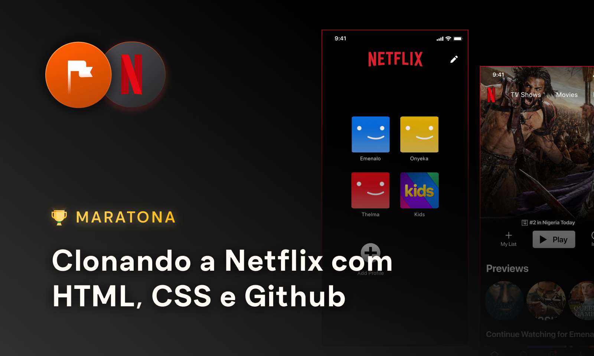

<!-- # Maratona Clonando Netflix -->

    

 

## Descrição 
A Maratona Clonando a Netflix tem como objetivo de replicar a versão mobile da Netflix. Junto com a [Maratonas Academy](https://www.maratonas.academy/) que aplica uma metodologia intensiva desenvolvida na Coreia do Sul, onde aplica desafios diariamente colocando em prática o conhecimento adquirido no dia por 14 dias.

## Tecnologias utilizadas
- HTML
- CSS
- Vercel (Deploy)

## Padronizações 
- HTML: Tags Semânticas
- CSS: BEM (Block Element Modifier)
- Git: Conventional Commits

## Site
Pode ser acessado: [Clicando aqui](https://maratona-clonando-netflix.vercel.app/)